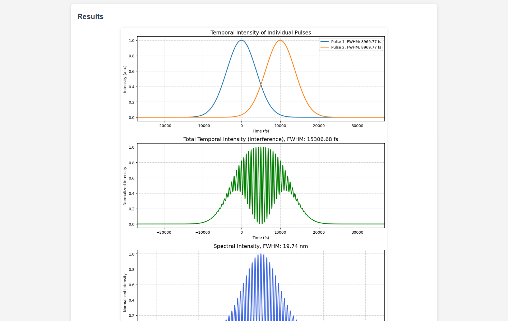

# Multi-Pulse Interference Analyzer

A web-based tool for simulating and analyzing the temporal and spectral interference patterns of multiple laser pulses with customizable dispersion characteristics.



## 🚀 Live Demo

Try the tool online: [https://visuphy.org/MultiPulseInterference](https://visuphy.org/MultiPulseInterference)

## 📋 Features

- **Multi-Pulse Simulation**: Analyze up to 6 laser pulses simultaneously
- **Flexible Pulse Shapes**: 
  - Gaussian
  - Sech² (hyperbolic secant squared)
  - Custom imported spectral shapes from CSV files
- **Comprehensive Parameters**:
  - Central wavelength and bandwidth
  - Amplitude control
  - Phase coefficients (φ₀ through φ₄) for modeling various dispersion effects
- **Visualization Options**:
  - Individual pulse temporal intensities
  - Total temporal intensity (interference pattern)
  - Spectral intensity interference
  - Intensity autocorrelation trace
- **Interactive Controls**:
  - Adjustable grid size for simulation resolution
  - Customizable axis ranges for all plots
  - Real-time coordinate display on hover

## 🛠️ Installation

### Prerequisites

- Python 3.7 or higher
- pip (Python package installer)

### Local Setup

1. Clone the repository:
```bash
git clone https://github.com/visuphy/MultiPulseInterference.git
cd MultiPulseInterference
```

2. Create a virtual environment (recommended):
```bash
python -m venv venv
source venv/bin/activate  # On Windows: venv\Scripts\activate
```

3. Install dependencies:
```bash
pip install -r requirements.txt
```

## 🎮 Usage

### Running Locally

For local development with the proper URL structure:

```bash
python run_local.py
```

Then navigate to:
- Intro page: http://localhost:5000/MultiPulseInterference/
- Tool page: http://localhost:5000/MultiPulseInterference/tool

### Using the Tool

1. **Add Pulses**: Click "Add Pulse" to create new pulse configurations (up to 6)
2. **Configure Parameters**:
   - Set central wavelength (nm) and bandwidth FWHM (nm)
   - Adjust amplitude (arbitrary units)
   - Configure phase coefficients:
     - φ₀: Carrier-Envelope Phase (CEP) in radians
     - φ₁: Group Delay (time delay) in fs
     - φ₂: Group Delay Dispersion (GDD) in fs²
     - φ₃: Third-Order Dispersion (TOD) in fs³
     - φ₄: Fourth-Order Dispersion (FOD) in fs⁴
3. **Import Custom Spectra** (optional):
   - Select "Import from file" as the spectrum shape
   - Upload a CSV file with wavelength and intensity columns
   - Configure import settings (delimiter, header rows, scaling)
4. **Adjust Simulation Settings**:
   - Grid size (2^N points) - higher values give better resolution
   - Axis ranges for temporal, spectral, and autocorrelation plots
5. **Run Simulation**: Click "Run Simulation" to generate the analysis plots

## 📊 Output Plots

The tool generates four synchronized plots:

1. **Temporal Intensity of Individual Pulses**: Shows each pulse's intensity profile in time domain
2. **Total Temporal Intensity**: Displays the interference pattern from all pulses combined
3. **Spectral Intensity**: Shows the combined spectrum in wavelength domain
4. **Intensity Autocorrelation**: Useful for pulse characterization and measurement comparison

## 🔧 Technical Details

- **Backend**: Flask (Python web framework)
- **Computation**: NumPy for FFT operations, SciPy for interpolation
- **Visualization**: Matplotlib with Agg backend for server-side rendering
- **Frontend**: Vanilla JavaScript with responsive design

### Grid Size Considerations

- Default: 2^16 = 65,536 points
- Maximum (online version): 2^22 = 4,194,304 points
- For unlimited grid size, run locally with `APP_ENV=development`

## 📄 License

This project is licensed under the MIT License - see the [LICENSE](LICENSE) file for details.

## 👥 Authors

- **Original Author**: [Hussein-Tofaili](https://github.com/Hussein-Tofaili)
- **Hosted by**: [VisuPhy](https://github.com/visuphy)

## 🤝 Contributing

Contributions are welcome! Please feel free to submit a Pull Request.

1. Fork the repository
2. Create your feature branch (`git checkout -b feature/AmazingFeature`)
3. Commit your changes (`git commit -m 'Add some AmazingFeature'`)
4. Push to the branch (`git push origin feature/AmazingFeature`)
5. Open a Pull Request

## 🐛 Issues

If you encounter any problems or have suggestions, please [open an issue](https://github.com/visuphy/MultiPulseInterference/issues) on GitHub.

## 📝 Citation

If you use this tool in your research, please cite:

```
Multi-Pulse Interference Analyzer
https://github.com/visuphy/MultiPulseInterference
© 2025 VisuPhy
```